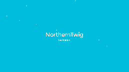

# Let it snow 
### A chrome extension for making the internet look a lot like Christmas

##### What is this?
* This is an extension for chrome which creates circles, representing snowflakes on every page you visit.
* It has easy to use sliders which easily change the size, amount, or speed of the the snowflakes.
* It smoothly travels downwards - as well as follows curves for side movement, which makes it extremely - Chistmassy.

##### How do I use it?
* Download the extension (Either clone - or use the green download button).
* Unzip the folder.
* Open chrome.
* Whilst in Chrome go to the extensions menu (You can write 'chrome://extensions' without the single quotes in the browser bar, or you can click the three dots on the upper right - hover 'more tools' - choose extensions).
* Enable developer mode.
* click 'Load unpacked extensions' and select the downloaded extensions folder.
* If it isn't automatically enabled, enable it.
* No snow is showing up? No problems! Click the 'Let it snow' icon in the extension bar to the upper left in Chrome, and click 'Toggle Snow' - and refresh (F5).
